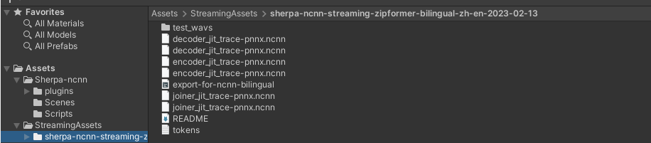
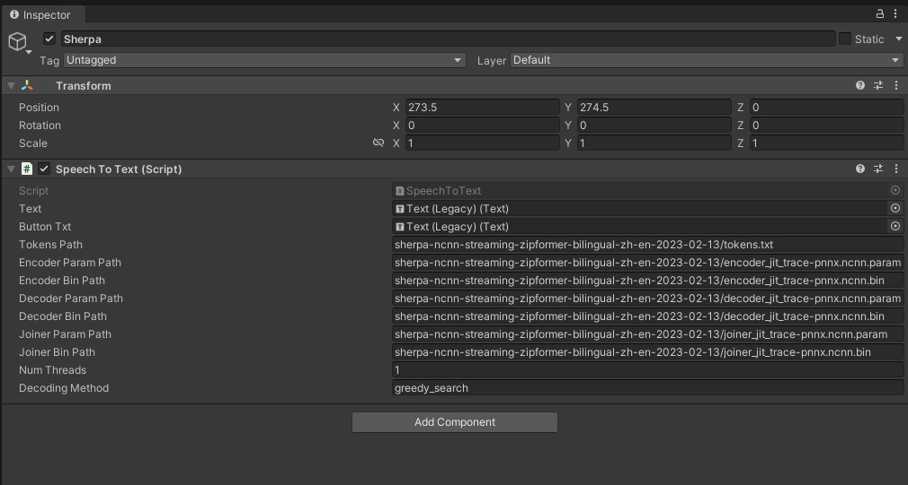
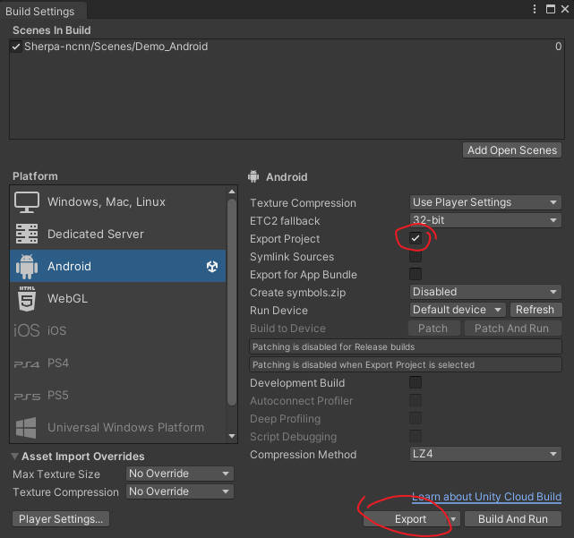
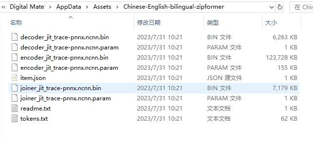

# sherpa-ncnn-unity
## 写在前面
最近尝试了很多种基于STT的方案，各种方案各有特点但始终没有找到一个能够满足自己需求的方案。最后发现了sherpa-ncnn这个项目，它是一个基于ncnn的新一代kaldi语音识别框架，支持多种语言，支持多种平台，支持多种模型。但是这个项目目前还没有适配Unity的方案，使用起来还是有一定的难度。所以我决定将它移植到Unity环境下，方便自己和其他人使用。
顺便说一下用过的STT方案，以供大家参考：
- 在线方案：（百度、讯飞、Azure语音识别等）免费额度少，需要实名认证，识别率高，在线识别延迟高 多语种同时识别
- 离线方案1:[whisper asr service](https://github.com/ahmetoner/whisper-asr-webservice/) 支持本地docker离线部署，提供api请求，多种语言识别，占资源，识别速度一般，中文识别能力一般 多语种同时识别
- 离线方案2:[Undertone](https://assetstore.unity.com/packages/tools/ai-ml-integration/undertone-offline-whisper-ai-voice-recognition-246877) 将whisper方案内置到unity中实现，免部署，占空间，多语种同时识别
- 离线方案3:[Speech Recognition System](https://assetstore.unity.com/packages/tools/audio/speech-recognition-system-187171) 基于Vosk的语音识别，支持多种语言，支持多种平台，支持多种模型，速度快，但只能单语种识别
- 离线方案4:[sherpa-ncnn](https://github.com/k2-fsa/sherpa-ncnn) 基于ncnn的新一代kaldi语音识别框架，支持多种语言，支持多种平台，支持多种模型，速度快，多语种同时识别，快，速度非常的快，但是没有Unity能直接使用的方案，这也是创建这个 repo 的原因
## Feature
在Unity环境下，借助sherpa-ncnn框架，实现实时并准确的中英双语语音识别功能。
## 支持平台
- [X] Windows
- [ ] WebGL (测试中)
- [X] Android 
- [ ] IOS （待接入）
## 效果
Windows

Android

## 使用说明
### Windows
1.下载需要使用的大模型文件，放到StreamingAssets文件夹下
</img>
2.配置路径 
</img>

### Android
注意：安卓版本因为原版是通过jni生成的so库，需要JNI来桥接Unity调用。在这里我为了操作流程简单，把基本实现的逻辑都写在了Android Studio工程的代码里中，Unity只执行UI的操作与结果的获取。
开发工作流：Unity 编写好调用JNI代码->生成输出AS工程->AS工程编写业务流程代码->AS输出apk包
</img>
</img>
</img>

主要的业务逻辑写在了AS工程的UnityPlayerActivity类中，其中k2fsa.sherpa.ncnn包的类是我从原版的kotlin代码转成java代码使用的，并没有改动原有的逻辑

## 模型架构介绍
https://k2-fsa.github.io/sherpa/ncnn/index.html

## 模型下载
https://k2-fsa.github.io/sherpa/ncnn/pretrained_models/index.html
  
## 感谢
https://github.com/k2-fsa/sherpa-ncnn

## 题外话
说实话，能找到sherpa-ncnn这个方案纯属巧合。因为有做实时TTS的需求，逛一轮后推荐的都是whisper或者百度讯飞这类的在线服务，但它们的缺点也很明显，不是不够实时就是不够准确，或者又是不支持多语种同时识别。机缘巧合之下玩了一下steam上的[数字伙伴](https://steamcommunity.com/app/2488350) ，发现它的语音识别速度非常快，准确率也很高，不仅能离线而且支持中英语种同时识别。扒了一下它的文件资源半天发现了个类似大模型的文件夹
</img>
然后顺藤摸瓜，找到了sherpa-ncnn这个项目。在经过亲自的测试体验之后，我如同醍醐灌顶，对于这一领域有了更加深刻的理解。在认识到自己知识的局限性的同时，感激sherpa-ncnn项目的开发者们，不但做出了这么棒的实时语音工具，还不收分文就分享给了我们这些开发者。真心希望我也能帮上点忙，让更多人知道、用上这个项目。
